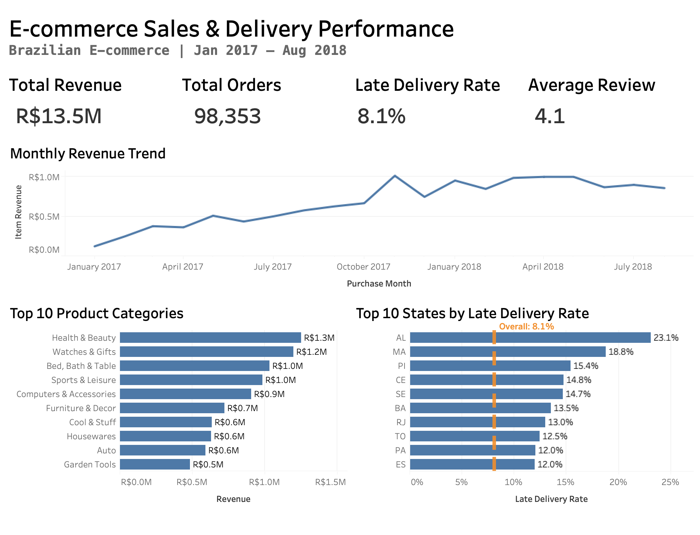

# E-commerce Sales & Delivery Performance Analysis

An end-to-end data analytics project using **SQL (DuckDB) and Tableau** to explore sales trends, product performance, and delivery efficiency in Brazilian e-commerce.

## Dashboard Preview



## Project Overview

This project analyzes the Brazilian E-commerce Public Dataset by Olist, focusing on three business questions:

- How did revenue change over time, and which product categories generated the most sales?
- Which geographic regions experienced the highest late delivery rates?
- How can sales and delivery performance be monitored through business KPIs?

The project transforms raw transactional data into structured analytical datasets and presents key performance metrics through a Tableau dashboard.

## Tools & Technologies

- **SQL / DuckDB:** Data transformation, aggregation, and analytical data modeling
- **Tableau:** Dashboard development and data visualization
- **Data Quality Checks:** Key uniqueness, missing values, referential integrity, and revenue reconciliation

## Data Pipeline

`Raw CSVs → DuckDB Views → Data Quality Checks → Analytical Data Marts → Tableau`

The SQL pipeline consists of five scripts:

| Script | Description |
|---|---|
| `00_source_views.sql` | Creates views over raw CSV files |
| `01_data_quality.sql` | Examines data completeness, uniqueness, and relationships |
| `02_order_mart.sql` | Builds an order-level analytical table |
| `03_item_sales_mart.sql` | Builds item-level and order-category analytical tables |
| `04_tableau_exports.sql` | Exports processed datasets for Tableau |

### Key Technical Decisions

- **Handling one-to-many relationships:** Aggregated order items and payments before joining them to orders to prevent duplicated revenue and order-level metrics.
- **Defining analytical grains:** Created separate order-level, item-level, and order-category data marts to support different analyses.
- **Data validation:** Included duplicate-key checks, missing-value inspections, and revenue reconciliation queries to evaluate data integrity.

## Running the SQL Pipeline

After downloading the Olist dataset and placing the CSV files in `data/raw/`, run the following commands from the project root:

```bash
duckdb data/olist.duckdb < sql/00_source_views.sql
duckdb data/olist.duckdb < sql/01_data_quality.sql
duckdb data/olist.duckdb < sql/02_order_mart.sql
duckdb data/olist.duckdb < sql/03_item_sales_mart.sql
duckdb data/olist.duckdb < sql/04_tableau_exports.sql
```
The pipeline creates analytical tables in DuckDB and exports processed CSV files to `data/processed/` for Tableau.

## Dashboard Highlights

The dashboard covers January 2017 through August 2018 and includes:
- **Total Revenue:** R$13.5M
- **Total Orders:** 98,353
- **Late Delivery Rate:** 8.1%
- **Average Review Score:** 4.1/5

### Key Observations

- Monthly revenue generally increased during 2017 and remained relatively stable at higher levels during much of 2018.
- Health & Beauty and Watches & Gifts were among the highest-revenue product categories.
- Late delivery rates varied considerably across states. Alagoas (AL) had the highest displayed rate at 23.1%, compared with the overall rate of 8.1%.

These findings are descriptive and do not establish the underlying causes of delivery delays.

## Data Source

[Brazilian E-Commerce Public Dataset by Olist — Kaggle](https://www.kaggle.com/datasets/olistbr/brazilian-ecommerce)

The raw dataset and generated analytical files are excluded from this repository. The SQL scripts document the transformations used to prepare the data for analysis.